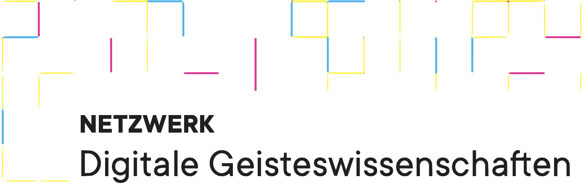

# Python🐍 for Poets📚

Are you ready to explore a new language? Learn to use **basic Python** and **Python for text processing** in 4 sessions. Just like with any other language, coding helps you create something that has not been there before. And the best part is: you can use it to handle and **process textual data** for **your own research** more efficiently. 

The course will start on the **3rd of November** and will take place **every two weeks** from **4:00pm to 6:00pm** (s.t).

## Course outline:

### 03.11.22:

#### Topics:
* Introduction to Programming
* Python Interpreter & built-in IDE (IDLE)
* Variables & Data types: Integers and Strings
* Python in Google Colab

#### Materials:
* [Slides](https://docs.google.com/presentation/d/1Snl7SSZqEDokU-eFD1vrR73pQC2dS8709B2Z1xaIDKw/edit?usp=sharing)
* [Introductory Colab Notebook](https://colab.research.google.com/drive/1FUSgW5i2s95KP_bMBObZQdSuQFRpP7QF?usp=sharing#scrollTo=5fCEDCU_qrC0)

### 17.11.22

#### Topics:
* Loops
* Conditional Statements
* Data Types: Lists and Dictionaries

#### Materials:
[2nd session Colab Notebook](https://colab.research.google.com/drive/1kT2D5Wv9gJFlswL_Jrgfse6TduOsohDu#scrollTo=6596eba5)
[Cheat sheet](https://gitup.uni-potsdam.de/sluytergaeth/python-mini-course/-/raw/session-2/cheatsheet2-fs.pdf?inline=false)

### 01.12.22

#### Topics:
* Text Lemmatisation
* POS-Tagging
* Reading and Writing Files

#### Materials:
- 🆕 [3rd session Colab Notebook](https://colab.research.google.com/drive/1nToyja4cJg2mGQPqrKNtRuO2NDjHYQQB?usp=sharing)
- 🆕 [Cheat sheet](cheatsheet3.pdf)
- 🆕 [3rd session Jupyter Notebook and Solutions - Zip-Bundle](notebook.zip)
- 🆕 [corpus](corpus.zip)

### 15.12.22

#### Topics:
* 🆕 Finishing lemmatisation & POS-tagging
* Reading and Writing JSON and CSV Files
* Pandas for Data Processing
* Data Visualisation

#### Materials:
- 🆕 [4rth session Colab Notebook](https://colab.research.google.com/drive/1SQ0jlNRfCS0Zld5XxbHTNjIHsKtIB3Rf#scrollTo=pxDpGPSWN7K6)
- 🆕 [Cheat sheet](https://gitup.uni-potsdam.de/sluytergaeth/python-mini-course/-/blob/session-4/session-4/cheatsheet4.pdf)
- 🆕 [corpus](corpus.zip)
- 🆕 [Cornell Movies Data](moviesdata.zip)

## Course requirements:

No technical skills required. We will assume zero previous experience with Python. The course is specifically intended to introduce programming to researchers involved with the arts and humanities. The course will be in English for more inclusion of both students and teachers. But we will use both German and English texts for processing.

## Location:

The course will take place at Campus Neues Palais, room **1.09.2.06**

If you are interested, please [register](https://moodle2.uni-potsdam.de/course/view.php?id=34686) until October 21. We’ll be happy to see you at the course!

## Organizers

* Henny Sluyter-Gäthje (Department of German Studies UP, Digital Humanities Network UP)
* Johanna Rockstroh (Department of Romance Studies UP)
* Friederike Schulz (Department of Romance Studies UP)
* Daniil Skorinkin (Digital Humanities Network UP)

## Disclaimer 

The name 'Python for Poets' is a tribute to the (old but gold) '[Unix for Poets](https://www.cs.upc.edu/~padro/Unixforpoets.pdf)' tutorial. We will not actually use Python for poetic purposes or verse studies during our course (although you will be able to do it yourself after the course, if you wish). The name Python for Poets is only there to highlight the 'humanistic flavour' of the course. 

